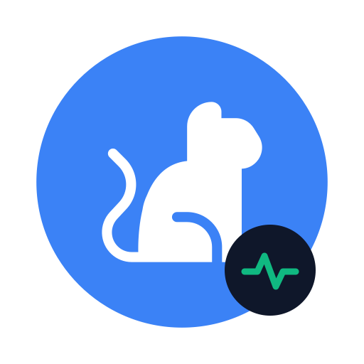
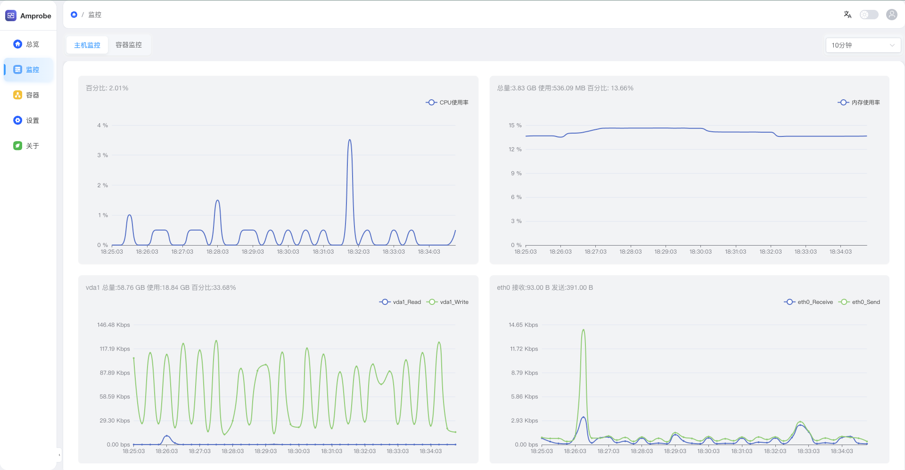
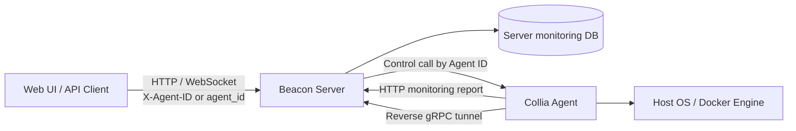

> [!IMPORTANT]
> **Repository rename:** this repository has moved from `amuluze/amprobe` to `amuluze/beacon`. GitHub temporarily redirects old links, but existing clones should run `git remote set-url origin git@github.com:amuluze/beacon.git` and update bookmarks, badges, and automation to the new address.

<p align="center">
  
</p>

<h1 align="center">Beacon</h1>

<p align="center">
  <strong>An open-source, lightweight and modern host & Docker monitoring platform</strong><br />
  <sub>开源、轻量、现代化的主机与 Docker 容器监控平台</sub>
</p>

<p align="center">
  <a href="https://github.com/amuluze/beacon/stargazers"></a>
  <a href="https://github.com/amuluze/beacon/releases"></a>
  
  
  <a href="./LICENSE"></a>
</p>

<p align="center">
  <a href="./README.md">中文</a> · English
</p>

---

<p align="center">
  <a href="#-introduction">Introduction</a> ·
  <a href="#-features">Features</a> ·
  <a href="#-architecture">Architecture</a> ·
  <a href="#-quick-start">Quick Start</a> ·
  <a href="#%EF%B8%8F-tech-stack">Tech Stack</a> ·
  <a href="#-project-structure">Project Structure</a> ·
  <a href="#-documentation">Documentation</a>
</p>

---

## 📖 Introduction

**Beacon** is a Server-Agent platform for host monitoring and Docker container management. It is designed for individual developers and small teams that need one place to observe and operate multiple servers.

- **Beacon Server** provides the Web UI, HTTP API, authentication, authorization, auditing, monitoring storage, and task orchestration.
- **Collia Agent** collects host and Docker metrics, reports monitoring batches over HTTP, and opens a reverse gRPC tunnel for Server-initiated control calls.
- Query and control requests must explicitly select an Agent, preventing implicit fallback or cross-node reads.

Website: [help.beacon.amuluze.com](https://help.beacon.amuluze.com) · Repository: [github.com/amuluze/beacon](https://github.com/amuluze/beacon)

## 🖼️ Screenshot


<details>
<summary>More screenshots</summary>

| Container monitoring | Host monitoring |
|---|---|
|  |  |

</details>

## ✨ Features

### 🐳 Docker management

- Inspect Docker versions and runtime status.
- Create, start, stop, restart, delete, and inspect container logs.
- Import, export, delete, and clean dangling images.
- Create, delete, and inspect Docker networks.

### 🖥️ Host monitoring

- Inspect host name, uptime, distribution, kernel, and operating system.
- Track CPU, memory, disk IO, and network IO trends.
- Perform host and container operations through an explicitly selected Agent.

### 🔐 Access control and auditing

- User, role, and API permission management.
- Login, logout, and system operation audit records.
- Production checks for signing keys, Agent join tokens, and install tokens.

### 🔄 Agent lifecycle

- Agent version reporting and online status tracking.
- Collia amd64/arm64 packages are distributed by the Beacon image.
- Remote update, self-update, uninstall, and reverse-tunnel control flows.

## 🏗️ Architecture



Beacon keeps three paths distinct:

1. **Monitoring queries** read the selected Agent's data from the Server-side monitoring database.
2. **Monitoring reports** are atomically persisted in batches sent by Collia over HTTP.
3. **Control calls** target an Agent through the reverse gRPC tunnel opened by Collia.

See [System Architecture](./.docs/architecture.md) and [Data Flow](./.docs/concepts/data-flow.md) for the complete boundaries and dependency direction.

## 🚀 Quick Start

### Online installer (recommended)

```bash
bash -c "$(curl -fsSLk https://help.beacon.amuluze.com/release/latest/manager.sh)"
```

The installer guides you through Web port, Agent control port, and security credential configuration.

### Run from source

Prerequisites:

- Docker >= 20.10.9 with Docker Compose.
- Go 1.25 for local backend development.
- Node.js, pnpm, and [Task](https://taskfile.dev/) to build Web assets.

```bash
# Clone the renamed repository
git clone https://github.com/amuluze/beacon.git
cd beacon

# Build frontend assets
task beacon-web:install
task beacon-web:build

# Build the Beacon image and start the local Compose stack
docker build -f beacon/Dockerfile -t beacon:latest .
docker compose -f deploy/docker-compose.yml up -d

# Verify
curl http://127.0.0.1:8000/health
```

The local Compose stack exposes `8000` for HTTP and `17000` for Agent control and is intended for development and verification. Before production deployment, generate unique high-entropy secrets and inject `BEACON_AUTH_SIGNING_KEY`, `BEACON_AGENT_INSTALL_TOKEN`, and `BEACON_CONTROL_JOIN_TOKEN`.

After Beacon starts, install Collia on a target host (replace the address, node number, and token with real values):

```bash
curl -kfsSL 'http://<beacon-host>:8000/api/v1/host/install?node=1' | sudo bash -s -- --token=<install-token>
```

## 🛠️ Tech Stack

| Layer | Technology |
|---|---|
| Web frontend | Vue 3, TypeScript, Vite, Element Plus, Pinia, ECharts |
| Server | Go 1.25, Fiber, GORM, WebSocket |
| Agent | Go, gopsutil, Docker Engine API |
| Control channel | Agent-initiated reverse gRPC tunnel |
| Monitoring channel | HTTP batch reporting and Server-side persistence |
| Storage | SQLite, with other databases available through GORM |
| Deployment | Docker, Docker Compose, Kubernetes |

## 📁 Project Structure

```text
beacon/
├── beacon/                 # Server, Web UI, HTTP/WS API, and tunnel client
│   ├── cmd/beacon/         # Server process entrypoint
│   ├── service/            # Business services, routing, auth, and persistence
│   └── web/                # Vue 3 admin UI
├── collia/                 # Agent collection, host/Docker ops, tunnel service
├── common/                 # Shared schemas, database, and tunnel transport
├── website/                # Product website and installer service
├── deploy/                 # Docker Compose and Kubernetes manifests
├── .docs/                  # Current implementation documentation
├── .specs/                 # SDD Domain and Task Specs
└── Taskfile.yml            # Workspace command entrypoint
```

## 📚 Documentation

| Document | Contents |
|---|---|
| [Architecture](./.docs/architecture.md) | Module boundaries, runtime paths, and dependency direction |
| [Data Flow](./.docs/concepts/data-flow.md) | Request lifecycle, data ownership, and cross-module flow |
| [Deployment](./.docs/deployment.md) | Environment, build, configuration, and release checks |
| [API Routes](./.docs/api/routes.md) | Current HTTP route and handler index |
| [OpenAPI](./.docs/api/openapi.yml) | Beacon HTTP API contract |
| [Domain Constraints](./.specs/domain/monitoring-platform.md) | Durable monitoring behavior and invariants |

## 🧑‍💻 Development and Contributing

Common commands:

```bash
task beacon:dev
task beacon-web:dev
task collia:amd64

cd beacon && go test ./...
cd collia && go test ./...
cd common && go test ./...
cd beacon/web && pnpm test:run && pnpm ts && pnpm build
```

Issues and pull requests are welcome:

1. Fork [this repository](https://github.com/amuluze/beacon).
2. Create a focused branch and run the relevant checks.
3. Commit a clear, reviewable change.
4. Push the branch and open a Pull Request.

## ☕ Support and Contact

Beacon is maintained in the author's spare time. If it helps you, please give the project a ⭐ or consider buying the author a coffee.

<details>
<summary>Donation and contact QR codes</summary>

<p>
  
  
  
</p>

</details>

## 📄 License

Beacon is open source under the [MIT License](./LICENSE).

## 🙏 Acknowledgements

Special thanks to [JetBrains](https://www.jetbrains.com/) for supporting open-source development tools.

---

<p align="center">
  <sub>Built with ❤️ and ☕</sub>
</p>
