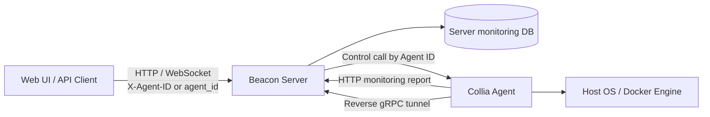

> [!IMPORTANT]
> **仓库更名说明：** 本仓库已由 `amuluze/amprobe` 更名为 `amuluze/beacon`。GitHub 会暂时重定向旧链接，但请在已有本地仓库中执行 `git remote set-url origin git@github.com:amuluze/beacon.git`，并将收藏、徽章与自动化配置更新为新地址。

<p align="center">
  
</p>

<h1 align="center">Beacon</h1>

<p align="center">
  <strong>开源、轻量、现代化的主机与 Docker 容器监控平台</strong><br />
  <sub>An open-source, lightweight and modern host & Docker monitoring platform</sub>
</p>

<p align="center">
  <a href="https://github.com/amuluze/beacon/stargazers"></a>
  <a href="https://github.com/amuluze/beacon/releases"></a>
  
  
  <a href="./LICENSE"></a>
</p>

<p align="center">
  中文 · <a href="./README.en.md">English</a>
</p>

---

<p align="center">
  <a href="#-项目简介">项目简介</a> ·
  <a href="#-功能特性">功能特性</a> ·
  <a href="#-系统架构">系统架构</a> ·
  <a href="#-快速开始">快速开始</a> ·
  <a href="#%EF%B8%8F-技术栈">技术栈</a> ·
  <a href="#-项目结构">项目结构</a> ·
  <a href="#-项目文档">项目文档</a>
</p>

---

## 📖 项目简介

**Beacon** 是一个采用 Server-Agent 架构的主机监控与 Docker 容器管理平台，面向需要统一观察、管理多台服务器的个人开发者与小型团队。

- **Beacon Server** 提供 Web UI、HTTP API、认证授权、审计、监控数据存储与任务编排。
- **Collia Agent** 采集主机和 Docker 指标，通过 HTTP 上报监控批次，并主动建立反向 gRPC tunnel 接收 Server 控制调用。
- 查询与控制请求必须显式指定 Agent，避免默认节点回退或跨节点读取。

官网：[beacon.amuluze.com](https://beacon.amuluze.com) · 仓库：[github.com/amuluze/beacon](https://github.com/amuluze/beacon)

## 🖼️ 产品截图

详细界面截图请访问官网 [beacon.amuluze.com](https://beacon.amuluze.com)。

## ✨ 功能特性

### 🐳 Docker 管理

- 查看 Docker 版本与运行状态。
- 管理容器的创建、启动、停止、重启、删除与日志。
- 管理镜像导入、导出、删除和虚悬镜像清理。
- 创建、删除并查看 Docker 网络状态。

### 🖥️ 主机监控

- 查看主机名、启动时间、发行版、内核与系统类型。
- 观察 CPU、内存、磁盘 IO 与网络 IO 趋势。
- 通过明确选择的 Agent 执行主机与容器控制操作。

### 🔐 权限与审计

- 用户、角色与接口权限管理。
- 登录、登出和系统操作审计。
- 生产模式下校验签名密钥、Agent 加入令牌与安装令牌。

### 🔄 Agent 生命周期

- Agent 版本上报与在线状态跟踪。
- Collia amd64/arm64 安装包由 Beacon 镜像统一提供。
- 支持远程更新、自更新、卸载和反向 tunnel 控制。

## 🏗️ 系统架构



Beacon 将三条路径明确分离：

1. **监控查询**：Web 请求从 Server 本地监控表读取指定 Agent 的数据。
2. **监控上报**：Collia 通过 HTTP report 接口按批次原子写入 Server。
3. **控制调用**：Beacon 通过 Collia 主动建立的反向 gRPC tunnel 调用目标 Agent。

更完整的边界、依赖方向和数据流见各模块内的 `README.md` 与代码注释。

## 🚀 快速开始

### 在线安装（推荐）

```bash
bash -c "$(curl -fsSLk https://beacon.amuluze.com/release/latest/manager.sh)"
```

安装脚本会引导配置 Web 端口、Agent 控制端口与安全凭据。

### 从源码启动

环境要求：

- Docker >= 20.10.9，并安装 Docker Compose。
- Go 1.25（本地开发后端时需要）。
- Node.js 与 pnpm（构建 beacon/web 管理端时需要）。

```bash
# 克隆新仓库
git clone https://github.com/amuluze/beacon.git
cd beacon

# 构建 beacon/web 管理端静态资源
cd beacon/web
pnpm install
pnpm build
cd ../..

# 构建 Beacon 镜像
docker build -f beacon/Dockerfile -t beacon:latest .

# 验证服务（按需自行编排 docker run 或本地 go run）
curl http://127.0.0.1:8000/health
```

本地开发可仅运行 `cd beacon && go run ./cmd/beacon` 启动 Server；生产部署前请生成独立的高强度密钥，并使用 `BEACON_AUTH_SIGNING_KEY`、`BEACON_AGENT_INSTALL_TOKEN`、`BEACON_CONTROL_JOIN_TOKEN` 注入。

Beacon 启动后，可从目标主机安装 Collia Agent（将地址、节点编号和 Token 替换为实际值）：

```bash
curl -kfsSL 'http://<beacon-host>:8000/api/v1/host/install?node=1' | sudo bash -s -- --token=<install-token>
```

## 🛠️ 技术栈

| 层级 | 技术 |
|---|---|
| Web 前端 | Vue 3、TypeScript、Vite、Element Plus、Pinia、ECharts |
| Server | Go 1.25、Fiber、GORM、WebSocket |
| Agent | Go、gopsutil、Docker Engine API |
| 控制通道 | Agent 主动连接的反向 gRPC tunnel |
| 监控通道 | HTTP 批次上报与 Server 本地持久化 |
| 数据存储 | SQLite，支持通过 GORM 扩展其他数据库 |
| 部署 | Docker、Docker Compose、Kubernetes |

## 📁 项目结构

```text
beacon/
├── beacon/                 # Server、Web UI、HTTP/WS API 与 tunnel client
│   ├── cmd/beacon/         # Server 进程入口
│   ├── service/            # 业务服务、路由、认证与数据访问
│   ├── web/                # Vue 3 管理端（嵌入 Server 模块）
│   ├── Dockerfile          # Server 镜像构建入口
│   └── nginx/              # 反向代理配置
├── collia/                 # Agent 采集、Docker/主机操作与 tunnel service
├── common/                 # 共享 schema、数据库与 reverse tunnel transport
├── LICENSE                 # MIT License
└── go.work                 # Go workspace 定义
```

> 注：官网、部署清单、SDD 文档等周边资产不在本开源仓库内，参见 [beacon.amuluze.com](https://beacon.amuluze.com)。

## 🧑‍💻 开发与贡献

常用命令：

```bash
# 后端测试
cd beacon && go test ./...
cd collia && go test ./...
cd common && go test ./...

# 管理端构建与校验
cd beacon/web
pnpm install
pnpm test:run
pnpm ts        # vue-tsc 类型检查
pnpm build
```

欢迎提交 Issue 和 Pull Request：

1. Fork [本仓库](https://github.com/amuluze/beacon)。
2. 创建功能分支并完成最小验证。
3. 提交清晰、可审查的变更。
4. 推送分支并创建 Pull Request。

## ☕ 支持项目与联系作者

Beacon 由作者利用业余时间持续维护。如果项目对你有帮助，欢迎给仓库点一个 ⭐，也可以请作者喝杯咖啡。

<details>
<summary>展开赞赏码与联系方式</summary>

<p>
  
  
  
</p>

</details>

## 📄 License

Beacon 基于 [MIT License](./LICENSE) 开源。

## 🙏 鸣谢

特别感谢 [JetBrains](https://www.jetbrains.com/) 为开源项目提供开发工具支持。

---

<p align="center">
  <sub>用 ❤️ 与 ☕ 打造 · Built with ❤️ and ☕</sub>
</p>
